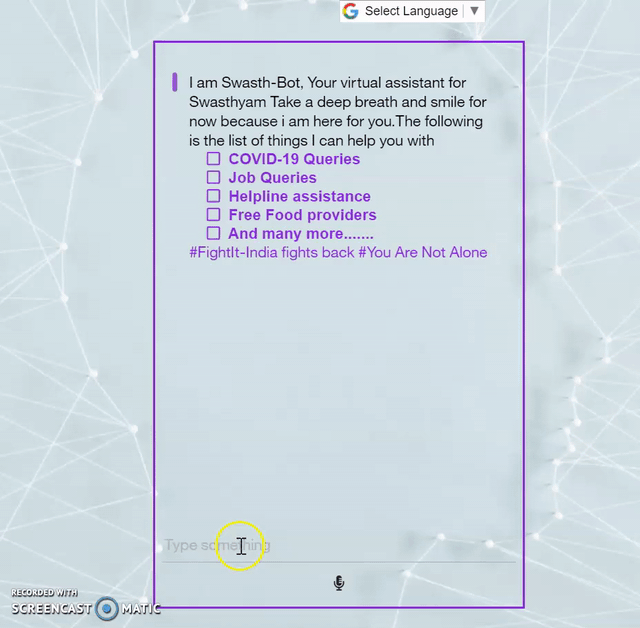

# Swasth-Bot
When the Covid-19 outbreak was declared a pandemic by the WHO it led to global policies of distancing, quarantines, travel restrictions, and cancellations of large gatherings, schools, colleges, shutting down offices and enabling employees to work remotely to aid in decreasing viral spread. In general public, significant anxiety is largely focused on family members and loved ones potentially contracting Covid-19, and is exacerbated by social media, self-quarantine, and misinformation. This has sparked perpetual worldwide fear, panic, anxiety, depression, desperation and distress along with concern for suicide, grief, post-traumatic stress, guilt, and long-term mental health disorders.
This is our Chat-Bot Solution to protect the mental health of people suffering from stress,anxiety,depression due to ongoing covid-19 pandemic over the world.This Bot focuses on directing users to the best sources recommended by professionals,experts & goverments.Tackling some of the fake news and getting the best and reliable information.

## Bot Can Help You With Following things :-
* COVID-19 Queries
* Corona Cases Throught the World
* Covid Testing Location In Your City
* Zone of Your City [Red(Danger),Orange(Warning) ,Green(No Risk)]
* Helpline assistance by State You Live In
* Free Food providers by NGO's In Your City
* Online Grocery Details In Your City
* Jobs Query
* Tell Joke
* Send Comedy Videos
* Send Meditation and Fitness Videos


## Features Of Chat Bot :-
* Reliable and best Information 
* Speech To Text
* Language Translater
* Easy to use and trust worthy

## API USED

* [COVID-19API](https://covid19api.com/) 
* [News API](https://newsapi.org/) 
* [COVID-19 REST API for India](https://api.rootnet.in/) 
* [COVID19-India API](https://api.covid19india.org/)
* [Joke](https://davidtkatz.com)

## Technology Used

* HTML,CSS,Bootstrap & Javascript 
* Node JS
* IBM Watson Assistant
* IBM Cloud Function


## Getting Started

These instructions will get you a copy of the project up and running on your local machine for development and testing purposes. See deployment for notes on how to deploy the project on a live system.

### Prerequisites

What things you need to install the software and how to install them

```
1. IBM Cloud account

2. Node.js
```

### Installing

A step by step series of examples that tell you how to get a development env running

Say what the step will be

```
git clone 

Login Into IBM Account add  Watson Assistant Service and Launch Watson Assistant and create Your Own Assistance

SET Environment variables & IBM Cloud connection parameters in .env File

Open Command Line and locate to Swasth-Bot

npm install

node server.js

```

Open [http://localhost:3000](http://localhost:3000) and take a look around.

## Here Is The Demo of Swasth Chat-Bot


<p align="center">
  
</p>


